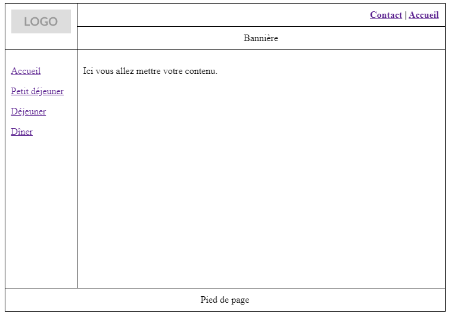
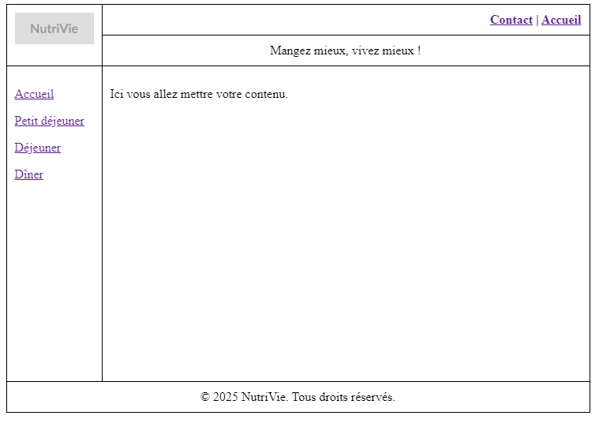
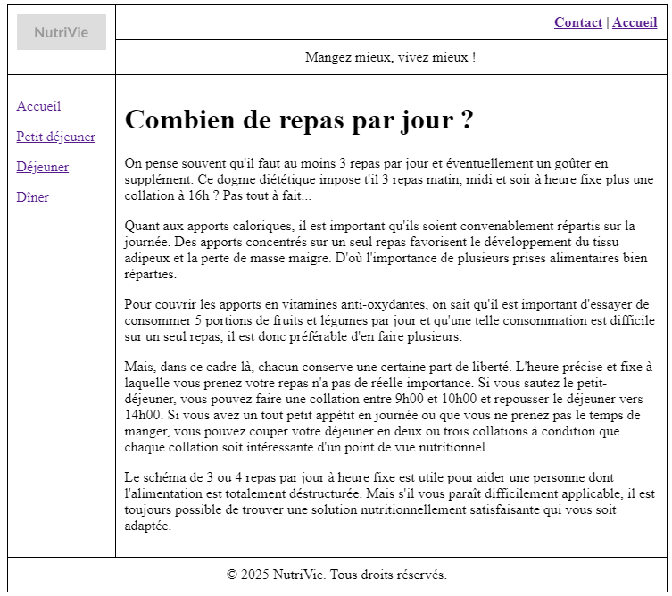
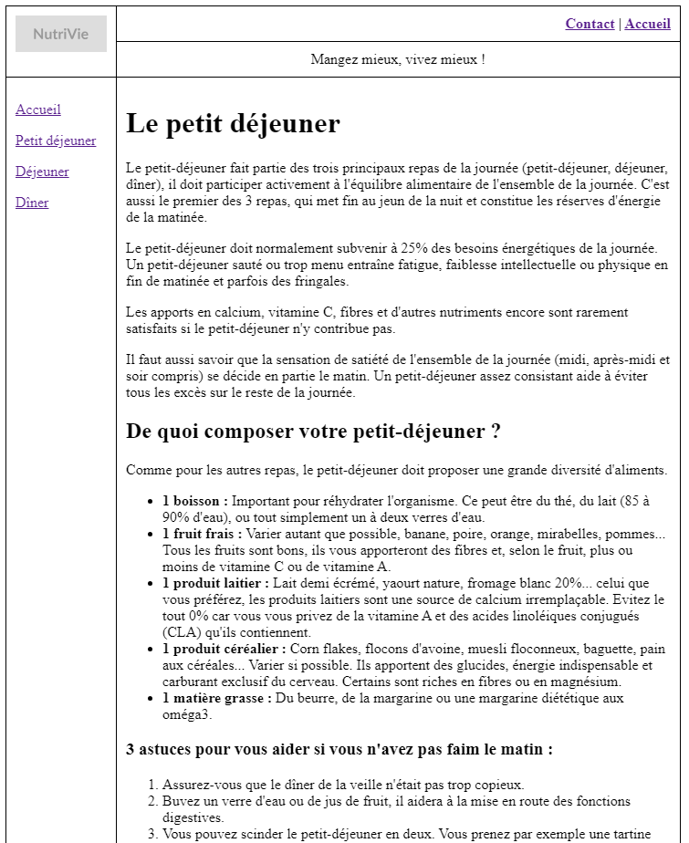
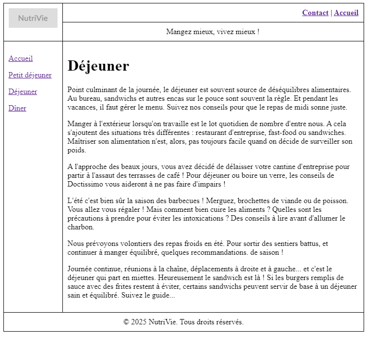
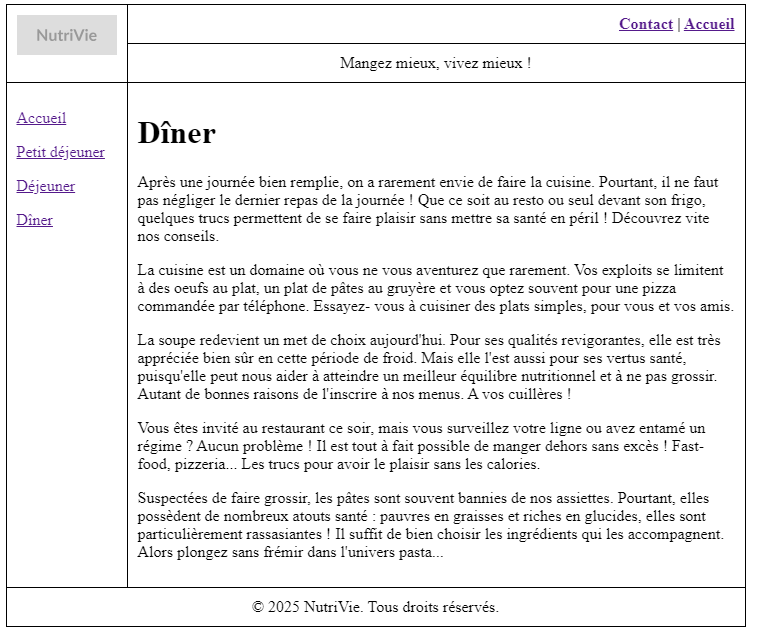
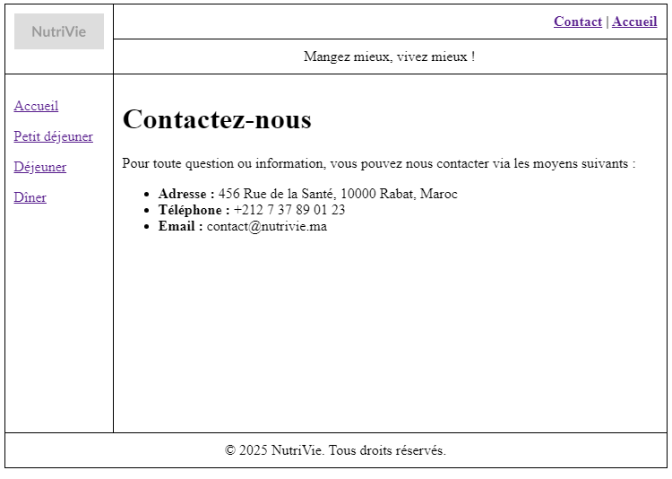

## Travaux Pratiques : HTML - Tableau
- Etudiant : **Oussama KHOUYA**
- Encadrente : **Pr. Oumayma AGHERAI**
- Cours : **Technologies Web et XML & Web sémantique**
- Date de soumission : **08-02-2025**
- Code source sur [github](https://github.com/khouya-ai/TP-web)

## Introduction
L'objectif de cet exercice est de créer un site web composé de quatre pages HTML, dont la disposition est basée sur des tableaux

### Structure du Site
Le site est structuré comme suit :

## Tâches Réalisées

1. **Création du Gabarit (`gabari.html`)** :
   - Créer une page HTML appelée `gabari.html` qui servira de modèle pour toutes les pages du site.
   - Cette page doit inclure les éléments communs à toutes les pages :
      - Le logo.
      - Le menu de navigation (Accueil, Petit déjeuner, Déjeuner, Dîner).
      - La bannière.
     - Le pied de page.
    
2. **Création des Pages Spécifiques** :
   - Utiliser le gabarit `gabari.html` pour créer les quatre pages suivantes :
      - **Index.html** : Page d'accueil.
      - **Petit-dejeuner.html** : Page décrivant le petit déjeuner.
      - **Dejeuner.html** : Page décrivant le déjeuner.
      - **Diner.html** : Page décrivant le dîner.
      - **contact.html** : Page Contact.

## Conclusion
Cet exercice permet de mettre en pratique les concepts de base de la création de sites web en utilisant des tableaux pour la mise en page. La création d'un gabarit commun (`gabari.html`) facilite la gestion des éléments répétitifs et assure une cohérence visuelle entre les différentes pages du site.