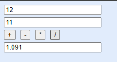

## TP : JavaScript Partie 2 - Évènements
Réalisé par **Oussama KHOUYA**, le : **25-02-2025**, lien sur [github](https://github.com/khouya-ai/TP-web)

L'objectif de ce tp est de pratiquer les évènements dans le language javascript :

### Exercice 1 : Permutation
 
```html
<style>
    body {
        background: #1b73e822;
    }
    .form {
        width: 200px;
        display: flex;
        flex-direction: column;
        gap: 5px;
    }
    input[type=button] {
        width: 100px;
    }
</style>

<body>
<div class="form">
    <input type="number" name="n1" id="n1">
    <input type="number" name="n2" id="n2">
    <input type="button" value="Permuter" onclick="permuter()">
</div>

<script>
    function permuter() {
        let n1 = document.getElementById("n1");
        let n2 = document.getElementById("n2");
        let temp = n1.value;
        n1.value = n2.value;
        n2.value = temp;
    }
</script>
</body>
```
### Exercice 2 : Calculatrice-Simple
   
```html
<style>
    body {
        background: #1b73e822;
    }
    .form {
        width: 200px;
        display: flex;
        flex-direction: column;
        gap: 5px;
    }
    input[type=button] {
        width: 100px;
    }
    .operations {
        display: flex;
        width: 15px;
        gap: 10px;
    }
</style>

<body>
<div class="form">
    <input type="number" name="n1" id="n1">
    <input type="number" name="n2" id="n2">
    <div class="operations">
        <input type="button" value="+" onclick="plus()">
        <input type="button" value="-" onclick="minus()">
        <input type="button" value="*" onclick="times()">
        <input type="button" value="/" onclick="divide()">
    </div>
    <input type="text" id="result">

</div>
<script>
    function plus() {
        result.value = Number(n1.value) + Number(n2.value);
    }
    function minus() {
        result.value = Number(n1.value) - Number(n2.value);
    }
    function times() {
        result.value = Number(n1.value) * Number(n2.value);
    }
    function divide() {
        result.value = Number(n1.value) / Number(n2.value);
    }
</script>
</body>
```
### Exercice 3 : Calcul IMC

```html
<head>
   <style>
        body {
            background: #1b73e822;
        }
        .form {
            display: flex;
            flex-direction: column;
            gap: 5px;
        }
        input[type=button] {
            width: 120px;
            padding: 5px 10px;
            background: #00c2c4;
            border-radius: 5px;
            color: white;
            border: 1px solid #aaa;
        }
        tr td:first-child {
            text-align: end;
        }
        #result {
            font-weight: bold;
        }

    </style>
</head>
<body>
<div class="form">
    <h1>Calculateur d'IMC</h1>
   <table>
       <tr>
           <td><label for="poinds">Poinds (kg): </label></td>
           <td><input type="number" name="poinds" id="poinds" value="85"></td>
       </tr>
       <tr>
           <td><label for="taille">Taille (m): </label></td>
           <td><input type="number" name="taille" id="taille" value="1.85"></td>
       </tr>
   </table>
    <input type="button" value="Calculer" onclick="calculer()">

    <p id="result"></p>
</div>
<script>
    function calculer() {

        let imc = Number(poinds.value) /(Number(taille.value) * Number(taille.value));

        result.innerText = "Votre IMC est " + imc.toFixed(2)+". "+imcText(imc);
    }

    function imcText(imc) {
        if(imc < 18.5) {
            return "Vous êtes en état d'insuffisance pondérale (maigreur)";
        }else if(imc < 25){
            return "Vous êtes en état de corpulence normale";
        }else if(imc < 30){
            return "Vous êtes en état de surpoids";
        }else if(imc < 35){
            return "Vous êtes en état d'obésité modérée";
        }else if(imc < 40){
            return "Vous êtes en état d'obésité sévère";
        }else {
            return "Vous êtes en état d'obésité morbide ou massive";
        }
    }
</script>
</body>
```
### Exercice 4 : Calculatrice-Avancée


- Le calule se base sur l'evaluation de la chaine entrée par l'utilisateur en utilisant la methode ``eval``
- L'utilisation des expressions régulieres facilite le remplacement des écriture mathematique par les expression et les fonctions math de javascript
```javascript
function calculateResult() {
        let expression = document.getElementById('display').value;

        // Remplacement
        expression = expression.replace(/π/g, 'Math.PI');
        expression = expression.replace(/e/g, 'Math.E');
        expression = expression.replace(/sin\(/g, 'Math.sin(');
        expression = expression.replace(/cos\(/g, 'Math.cos(');
        expression = expression.replace(/tan\(/g, 'Math.tan(');//bonne
        expression = expression.replace(/log\(/g, 'Math.log10(');//bonne
        expression = expression.replace(/ln\(/g, 'Math.log(');//bonne
        expression = expression.replace(/√\(/g, 'Math.sqrt(');//bonne
        expression = expression.replace(/\^/g, '**');//bonne
        expression = expression.replace(/\^2/g, '**2');//bonne

        try {

            document.getElementById('display').value = eval(expression);
        } catch (e) {
            alert('Expression non valide');
            clearDisplay();
        }
    }
```