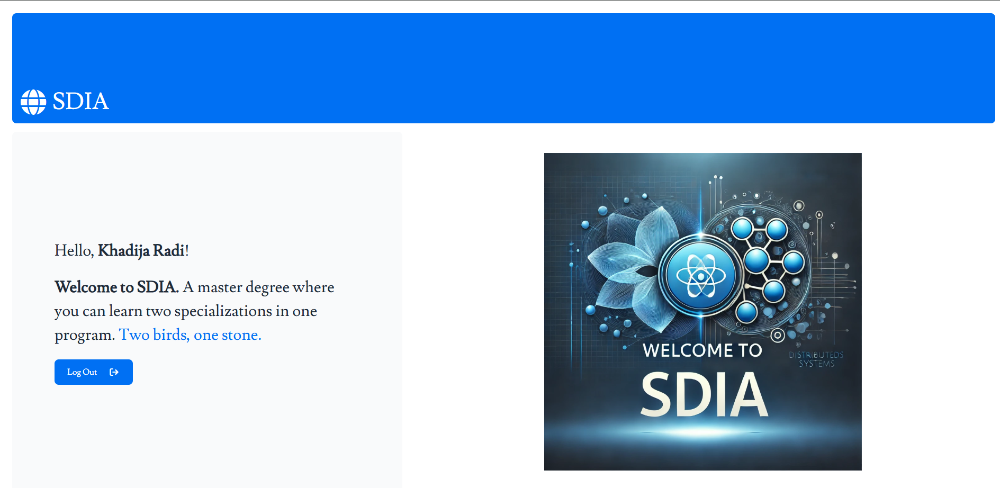
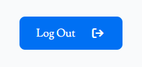

## TP5 : Angular et React
Réalisé par **Oussama KHOUYA**, le : **22-03-2025**, lien sur [github](https://github.com/khouya-ai/TP-web)

L'objectif de ce tp est de déveloper et comparer entre deux applications Angular et React :

### Angular
http://localhost:4200/register


[db.json](angular/db.json)
```json
{
  "users": [
    {
      "id": "07a9",
      "login": "khadija123",
      "name": "Khadija Radi",
      "password": "1234"
    }
  ]
}
```

http://localhost:4200/login







### React
