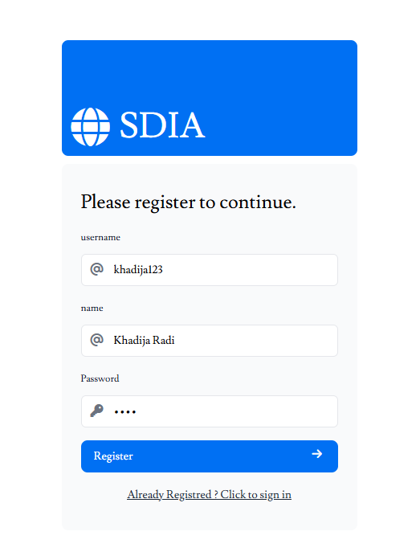
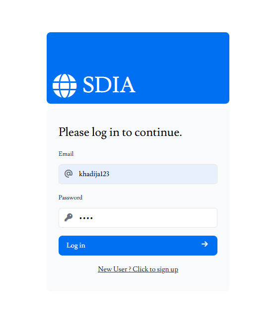
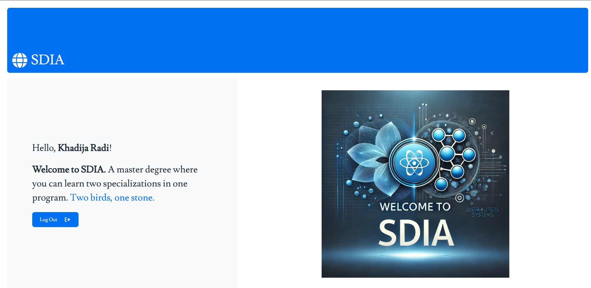
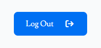
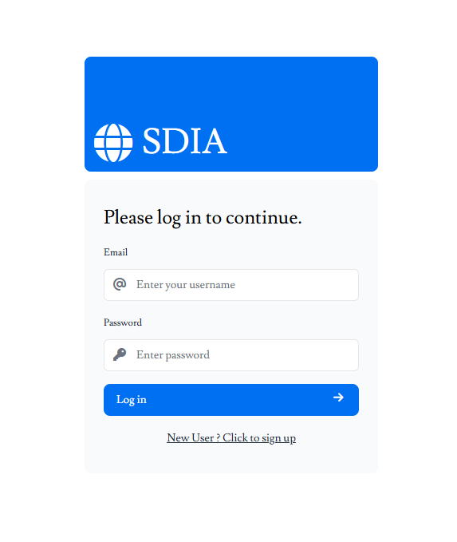

## TP5 : Angular et React
Réalisé par **Oussama KHOUYA**, le : **22-03-2025**, lien sur [github](https://github.com/khouya-ai/TP-web)

L'objectif de ce tp est de déveloper et comparer entre deux applications Angular et React :

L'application contient les fonctionnalités suivantes :
- Authentification
- Inscription
- Page d'accueil

Comment exécuter le projet :
```bash
# to run the \server
npx json-server db.json
# to run \angular
ng serve
# to run \react
npm run dev
```
Pour accéder au : 
-  serveur : [http://localhost:3000](http://localhost:3000) <br>
- l'application Angular : [http://localhost:4200](http://localhost:4200)<br>
-  l'application React : [http://localhost:3001](http://localhost:3001)
### Angular
Pour ajouter un nouveau utilisateur, aller sur [http://localhost:4200/register](http://localhost:4200/register)



Les informations sont stockées dans le fichier [db.json](server/db.json)
```json
{
  "users": [
    {
      "id": "07a9",
      "login": "khadija123",
      "name": "Khadija Radi",
      "password": "1234"
    }
  ]
}
```

Pour se connecter aller sur [http://localhost:4200/login](http://localhost:4200/login)



Après la connexion, l'utilisateur est redirigé vers la page d'accueil


pour se déconnecter, il suffit de cliquer sur le bouton `logout`



l'utilisateur est redirigé vers la page de connexion


