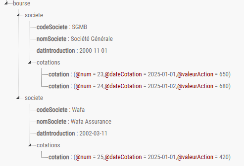

## Application : Document XML
Réalisé par **Oussama KHOUYA**, le : **13-04-2025**

L'objectif de cette application est de concevoir un document xml échangé entre la bourse et ses différents
partenaires.  :

La représentation graphique de l’arbre XML est : 



Le DTD correspondant est :
```dtd
<!ELEMENT bourse (societe+)>
<!ELEMENT societe (codeSociete, nomSociete, datIntroduction, cotations)>
<!ATTLIST societe type (banque | assurance) #REQUIRED>
<!ELEMENT codeSociete (#PCDATA)>
<!ELEMENT nomSociete (#PCDATA)>
<!ELEMENT datIntroduction (#PCDATA)>
<!ELEMENT cotations (cotation+)>
<!ELEMENT cotation EMPTY>
<!ATTLIST cotation
        num ID #REQUIRED
        dateCotation CDATA #REQUIRED
        valeurAction CDATA #REQUIRED>
```